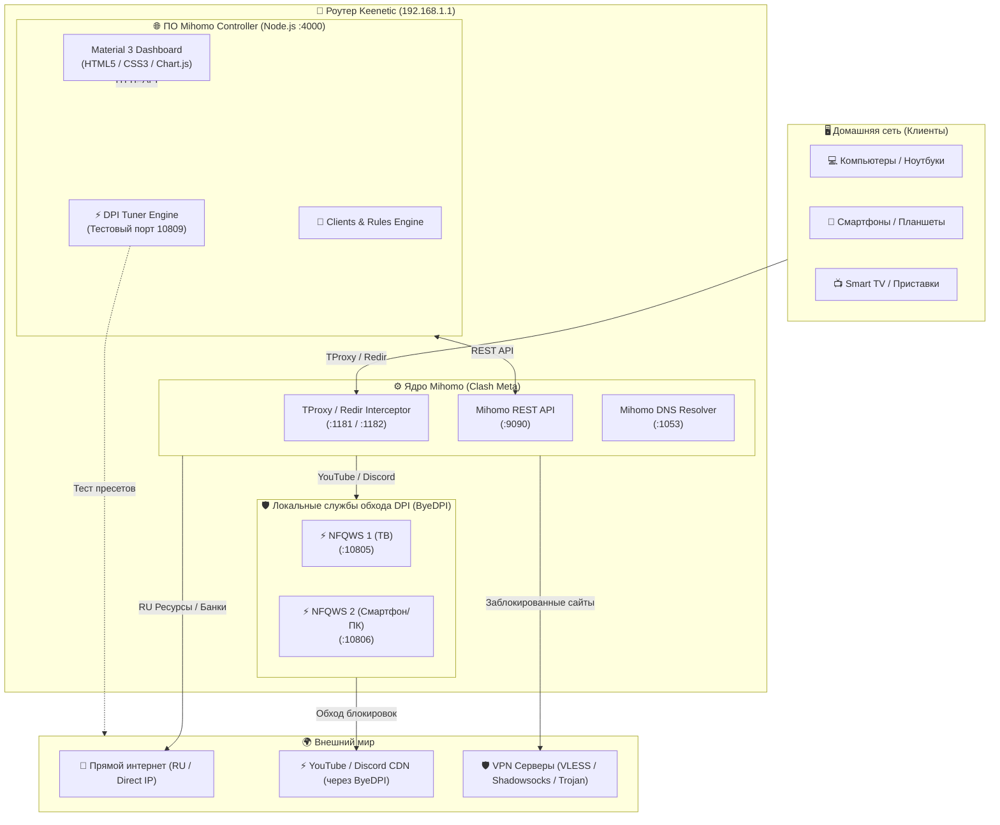
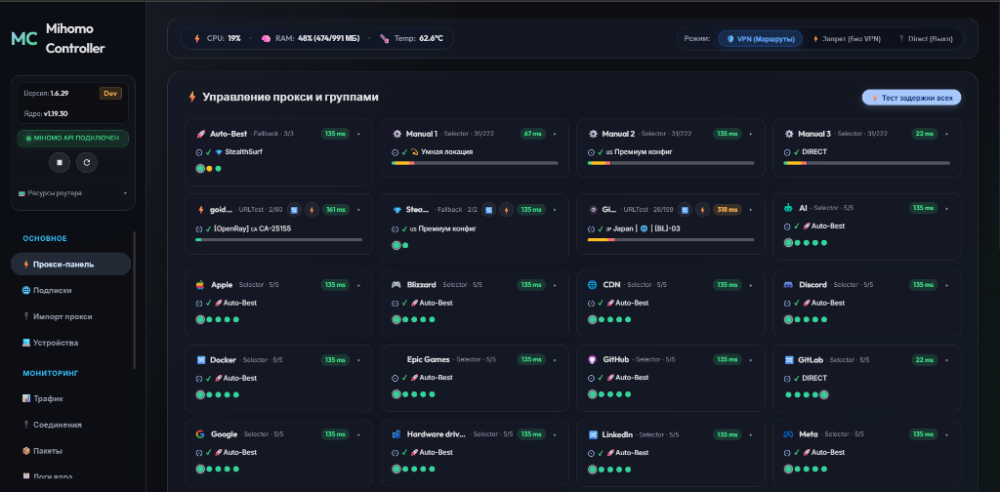
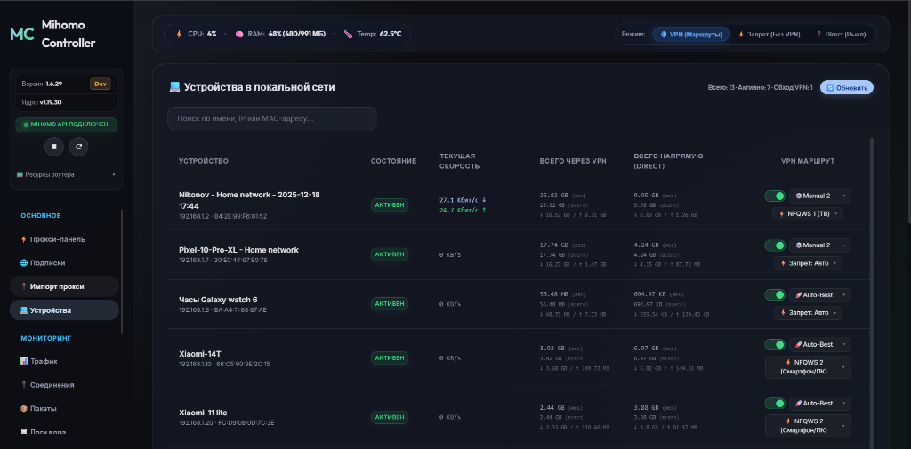
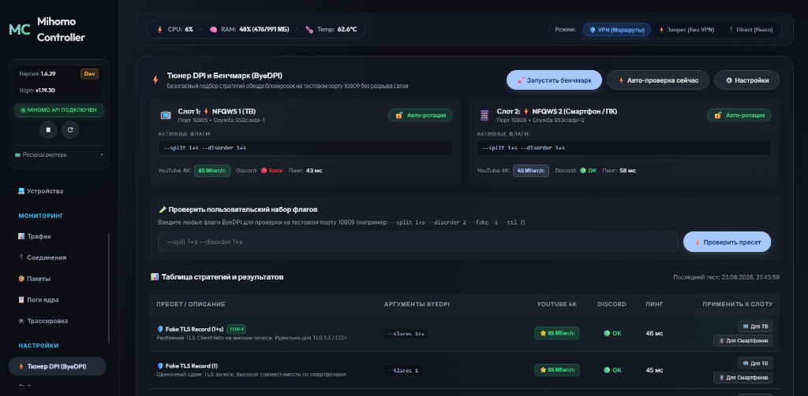
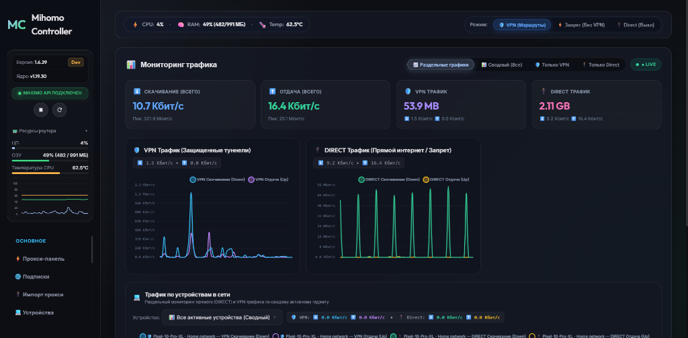
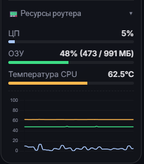

# Mihomo Controller

<p align="center">
  
</p>

<p align="center">
  <b>Современная веб-панель управления ядром Mihomo (Clash Meta) и DPI-тюнером для роутеров Keenetic</b>
</p>

<p align="center">
  
  
  
  
  
</p>

---

## 📖 О проекте

**Mihomo Controller** — это быстрая, отзывчивая и легковесная веб-панель для роутеров **Keenetic** с развернутой средой **Entware** (включая **XKeen** и **Mihomo / Clash Meta**).

Панель разработана на чистом **JavaScript / Node.js без внешних NPM-зависимостей** и тяжелых фреймворков. Она потребляет минимум ресурсов роутера (менее **0.5% CPU** в простое и всего **~11 МБ оперативной памяти**), обеспечивая при этом максимальную функциональность: от умного распределения клиентов и мониторинга соединений до автоматического подбора стратегий обхода блокировок DPI (ByeDPI / Zapret) с авто-ротацией.

---

## 📐 Архитектура системы



---

## 🚀 Быстрая установка

Для установки панели откройте SSH-консоль вашего роутера Keenetic (через PuTTY, Termius или встроенный SSH-клиент) и выполните одну команду:

```bash
sh -c "$(curl -fsSL https://raw.githubusercontent.com/Niko0197/Mihomo-controller/main/install.sh)"
```

### Что сделает установщик:
1. 🔍 **Авто-определение архитектуры процессора**: `aarch64` (ARM64), `armv7l` (ARM32), `mips`, `mipsel`.
2. 📦 **Проверка и установка окружения**: `node`, `git`, `curl`, `ciadpi` (ByeDPI).
3. ⚡ **Настройка встроенного обхода YouTube / Discord**: разворачивает независимые службы `S52ciadpi-1` (порт 10805, ТВ) и `S53ciadpi-2` (порт 10806, Смартфоны/ПК).
4. ⚙️ **Базовый конфиг `config.yaml`**: преднастроенная умная маршрутизация для РФ-сегмента.
5. 🚀 **Служба автозапуска Entware**: `/opt/etc/init.d/S99mihomo-controller` (панель стартует вместе с роутером).

После завершения перейдите в браузере по адресу:  
👉 **`http://192.168.1.1:4000`** *(или локальный IP вашего роутера)*.

---

## 📚 Подробный гайд по всем разделам и функциям

---

### 1. 🎛️ Прокси-панель (Proxy Dashboard)

Центральный пульт управления всеми вашими VPN-провайдерами, селекторами и узлами.

<p align="center">
  
</p>

- **Умные группы подписок (`url-test`)**:
  - Все добавленные подписки автоматически тестируют задержки (`http://cp.cloudflare.com/generate_204`, интервал 300с) и выбирают быстрейший узел.
  - На карточках провайдеров доступны кнопки **`🔄 Обновить подписку`** и **`⚡ Запустить тест задержек`**.
- **30+ сервисных селекторов**:
  - Отдельные селекторы маршрутизации для `YouTube`, `Discord`, `Telegram`, `Google`, `OpenAI / Claude (AI)`, `Steam`, `Twitch`, `TikTok`, `Apple`, `Docker`, `Spotify`, `GitHub`, `18+` и многих других.
  - Для каждого сервиса можно в 1 клик выбрать желаемый маршрут: `🚀Auto-Best`, конкретную страну (`🇺🇸 США`, `🇩🇪 Германия`, `🇳🇱 Нидерланды`), `DIRECT` или `⚡ NFQWS (Zapret)`.
- **Чистый интерфейс без дублей**: автоматическая синхронизация с памятью ядра исключает появление устаревших фантомных узлов.

---

### 2. 📱 Менеджер клиентов и устройств сети (Clients)

Позволяет индивидуально управлять доступом в интернет для каждого домашнего гаджета.

<p align="center">
  
</p>

- **Авто-обнаружение устройств**:
  - Панель опрашивает сетевые интерфейсы Keenetic (ARP-таблицу и Hotspot) и отображает все подключенные устройства с их именами (`💻 ПК`, `📱 iPhone`, `📺 ТВ Кухня`, `⌚ Apple Watch`).
- **Индивидуальный переключатель VPN**:
  - Включение/отключение VPN для конкретного устройства в один клик.
- **Индивидуальная прокси-группа**:
  - Назначьте рабочему ноутбуку `🇺🇸 Премиум США`, телевизору — `⚡ NFQWS (ТВ)`, а смартфону — `🚀Auto-Best`.
- **Мгновенный сброс соединений (< 2 мс)**:
  - При переключении правил панель точечно закрывает только открытые сокеты переключаемого устройства, **не разрывая связь у остальных домашних**.
- **Защита от IPv6 Privacy Extensions**:
  - Фильтрация временных динамических адресов смартфонов на iOS и Android для исключения утечек мимо прокси.

---

### 3. ⚡ Тюнер DPI и Авто-ротация (ByeDPI / Zapret Tuner)

Инновационный инструмент подбора стратегий обхода блокировок ТСПУ / РКН (YouTube 4K, Discord).

<p align="center">
  
</p>

- **Полная изоляция на тестовом порту `10809`**:
  - Во время проведения бенчмарка рабочие службы на портах `10805` и `10806` **не останавливаются**. Телевизоры и компьютеры продолжают работать без зависаний.
- **Реальные замеры метрик**:
  - **YouTube 4K**: скачивание реального тестового видеочанка с серверов `googlevideo.com` с замером скорости в **Мбит/с**.
  - **Discord Voice & Gateway**: проверка доступности шлюзов `discord.com` и `gateway.discord.gg`.
  - **TLS Handshake**: время отклика в миллисекундах (мс).
- **Каталог проверенных пресетов**:
  - `⚡ Split + Disorder (1+s)`
  - `🛡️ Fake TLS Record (1+s)`
  - `🛡️ Fake TLS Record (1)`
  - `🎭 Split 1 + Fake TTL (-1, ttl 8)`
  - `✂️ Split 2 (Mid-SNI)`
  - `🚀 Split + Disorder + Auto Torst`
  - `📡 Out-Of-Band (OOB 1+s)` и др.
- **Два независимых слота**:
  - `Слот 1: ⚡ NFQWS 1 (ТВ)` *(порт 10805, служба `S52ciadpi-1`)*
  - `Слот 2: ⚡ NFQWS 2 (Смартфон/ПК)` *(порт 10806, служба `S53ciadpi-2`)*
- **Система «Замочков» (Lock / Unlock)**:
  - 🔒 **Зафиксировано**: стратегия закреплена вручную пользователем. Фоновый планировщик не будет трогать этот слот.
  - 🔓 **Авто-ротация**: раз в 24 часа роутер в фоне проверяет качество связи. Если скорость деградирует (< 8 Мбит/с), система автоматически подберет и бесшовно применит лучшую стратегию.
- **Поле ручной проверки флагов**:
  - Введите любые кастомные параметры ByeDPI (например, `--split 1+s --disorder 2 --fake -1 --ttl 7`) и протестируйте их в 1 клик с возможностью мгновенного применения к ТВ или ПК.

---

### 4. 📊 Мониторинг трафика и Раздельные графики

Живая аналитика сетевой активности в реальном времени.

<p align="center">
  
</p>

- **Высокоточный поток (Live SSE Stream)**:
  - Замер общей скорости скачивания (Down) и отдачи (Up), учет пиковых значений и суммарных объемов данных.
- **Режимы отображения**:
  - `📈 Раздельные графики` *(рекомендуемый)*
  - `📊 Сводный (Все)`
  - `🛡️ Только VPN`
  - `🔌 Только Direct`
- **График потребления трафика по устройствам (Per-Device Live Tracking)**:
  - Отображает живое потребление по каждому подключенному клиенту сети.
  - **Сводный режим**: кривые для всех активных гаджетов.
  - **Детальный режим устройства**: 4 детальные кривые для выбранного гаджета (🛡️ VPN Down/Up и 🔌 Direct Down/Up) с подсветкой скорости в шапке.
  - **Статичные монолитные кнопки (Zero Layout Shift)**: кнопки устройств зафиксированы по алфавиту/IP и не скачут при изменении скоростей; светодиодные индикаторы активности (`🟢 Direct`, `🔵 VPN`, `🌐 Оба`) наглядно показывают, кто качает прямо сейчас.

---

### 5. 🔌 Активные соединения (Connections)

Детальный инспектор всех открытых сетевых сокетов ядра Mihomo.

- **Подробная таблица**: Источник (IP:Port), Назначение (домен / IP:Port), Протокол (TCP/UDP), Сработавшее правило маршрутизации, Цепочка прокси (`DIRECT` или `VPN ➔ Сервер`), Объем трафика и мгновенная скорость.
- **Живой поиск и фильтрация**: мгновенная фильтрация по хосту, IP клиента, правилу или прокси.
- **Управление сессиями**: кнопка точечного разрыва соединения `Разорвать` или кнопка `❌ Разорвать все`.

---

### 6. 📦 Монитор пакетов и процессов (Packet Monitor)

- Потоковое логирование сетевых пакетов в реальном времени.
- Удобно для отладки маршрутов и проверки, через какой узел пошёл тот или иной домен.

---

### 7. 📝 Редактор конфигурации (CodeMirror Editor)

- **Полнофункциональный веб-редактор `config.yaml`**:
  - Подсветка синтаксиса YAML, подсветка парных скобок, быстрый поиск и переход к строке.
  - Кнопка сохранения и безопасной валидации конфигурации.
- **Конструктор динамических правил**:
  - Добавление пользовательских правил (`DOMAIN-SUFFIX`, `IP-CIDR`, `GEOIP` и др.) прямо из графического интерфейса без риска сломать отступы YAML.

---

### 8. 📜 Системные логи ядра (Logs)

- Просмотр логов Mihomo в реальном времени с поддержкой фильтрации по уровням: `DEBUG`, `INFO`, `WARNING`, `ERROR`.
- Авто-прокрутка, пауза потока и фильтр поиска по тексту.

---

### 9. ⚙️ Системный центр и Управление ядром (System Hub)

<p align="center">
  
</p>

- **Аппаратная телеметрия роутера**:
  - Загрузка ЦП в %, использование оперативной памяти ОЗУ, температура процессора в °C и время непрерывной работы (Uptime).
- **Обновление ядра Mihomo в 1 клик**:
  - Загрузка официальных стабильных и альфа-релизов ядра Mihomo из GitHub-репозитория `MetaCubeX/mihomo` с автоматическим бэкапом и защитой от сбоев.
- **Менеджер версий веб-контроллера**:
  - Переключение между ветками (`Main` / `Dev`) и откат на любой предыдущий коммит прямо из браузера.
- **Мягкий перезапуск**: перезапуск веб-контроллера с сохранением статистики клиентов.

---

## 🔄 Обновление панели

Чтобы обновить установленную панель до версии **v1.7.1**, выполните в SSH:

```bash
sh -c "$(curl -fsSL https://raw.githubusercontent.com/Niko0197/Mihomo-controller/main/install.sh)"
```

*Все ваши пользовательские правила, настройки слотов DPI, замочки и базы данных трафика сохраняются автоматически.*

---

## 📝 История изменений (Changelog)

### Версия 1.7.1
- ⚡ **Мгновенный замер пинга в реальном времени**: При клике правой кнопкой мыши (ПКМ) по карточке группы или точке сервера выполняется честный живой сетевой замер «здесь и сейчас», а не возврат старого значения из кэша.
- 🎯 **Устранение расхождения пинга DIRECT**: Прямой интернет (`DIRECT`) теперь замеряется через единый движок ядра Mihomo, что устранило паразитную задержку локального DNS-резолва (~20 мс). Теперь пинг `DIRECT` и селектора `Manual 3` абсолютно одинаков (~20 мс).
- 🔍 **Поддержка `proxy.extra` в healthcheck**: Корректное считывание истории задержек из объекта `proxy.extra` для любых кастомных тестовых URL.
- 🧹 **Глубокая очистка подписок**: Механизм удаления подписок теперь каскадно вычищает провайдера, его карточки, `use:` / `proxies:` ссылки во всех 30+ группах и физически удаляет кэш-файлы `.yaml` с диска.
- 📊 **Адаптивная ширина графиков**: Раздельный вид мониторинга трафика переведён на двухколоночную сетку с заполнением 100% ширины экрана без пустых полей.

---

## 📋 Системные требования

| Компонент | Требование |
|---|---|
| **Роутер** | Любой роутер Keenetic с USB-портом (Giga, Ultra, Hero, Hopper, Peak, Extra и др.) |
| **Накопитель** | USB-флешка или SSD/HDD (файловая система EXT4, рекомендуется SWAP от 512 МБ) |
| **Среда** | Entware (пакеты `node`, `curl`, `git`, `ciadpi` устанавливаются автоматически) |
| **Ядро** | Mihomo (Clash Meta) / XKeen |

---

## 🗑️ Удаление

Для полного и чистого удаления панели и её служб автозапуска с роутера:

```bash
sh -c "$(curl -fsSL https://raw.githubusercontent.com/Niko0197/Mihomo-controller/main/uninstall.sh)"
```

---

## 🤝 Вклад в развитие и поддержка

Если у вас возникли вопросы или предложения по новым функциям:
- Создавайте [Issue](https://github.com/Niko0197/Mihomo-controller/issues) в репозитории.
- Отправляйте Pull Request'ы с улучшениями.

---

## 📄 Лицензия

Проект распространяется под открытой лицензией **MIT License** © 2026 [Niko0197](https://github.com/Niko0197).
