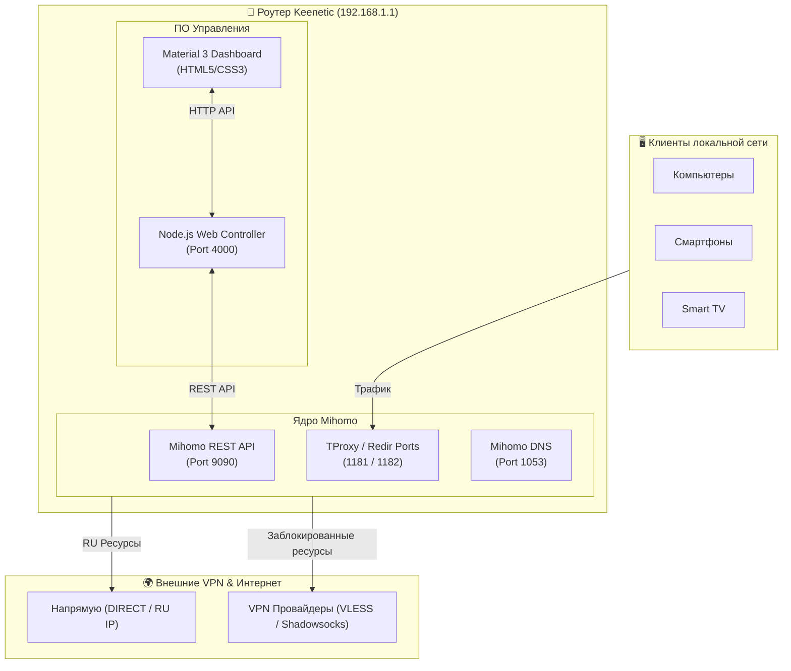

# Mihomo Controller

<p align="center">
  <b>Современная веб-панель управления ядром Mihomo (Clash Meta) для роутеров Keenetic</b>
</p>

<p align="center">
  
  
  
  
  
  
</p>

---

Быстрая, стильная и высокопроизводительная веб-панель для управления ядром **Mihomo (Clash Meta)** на роутерах Keenetic с установленным Entware (включая **XKeen**).

Интерфейс выполнен в премиальном стиле **Material 3 (Dark Glassmorphic)**. Проект написан на чистом JavaScript / Node.js **без тяжелых сторонних фреймворков и NPM-зависимостей**, что гарантирует минимальное потребление ресурсов роутера (менее 1% ЦП и ~11 МБ памяти Node.js).

---

## ✨ Ключевые возможности

### 🎛️ Умная Прокси-Панель (Proxy Dashboard)
- **Автоматическая адаптация подписок**: Все новые подписки автоматически регистрируются в группе типа `url-test` со встроенным замером задержек (`http://cp.cloudflare.com/generate_204`, интервал 300с).
- **Эксклюзивные кнопки управления**: Кнопки принудительного обновления подписки `🔄` и проведения теста задержки `⚡` отображаются строго на карточках самих провайдеров.
- **Лаконичный вид селекторов**: Системные группы (`🚀Auto-Best`, `⚙️Manual 1-3`, `GLOBAL`) и более 30 сервисных селекторов (`YouTube`, `Discord`, `Google`, `TikTok`, `Steam`, `Docker`, `Apple` и др.) избавлены от визуального шума.
- **Синхронизация памяти ядра**: Автоматическая отправка `PUT /configs` при старте веб-сервера исключает появление устаревших «фантомных» дублей в оперативной памяти Mihomo.

### 🚀 Мгновенное управление клиентами (< 50 мс)
- **Точечный контроль устройств**: Включение/выключение VPN и назначение индивидуальных прокси-групп для любого гаджета сети (ПК, смартфоны, Smart TV).
- **Мгновенный разрыв сокетов (2 мс)**: Сброс активных соединений только для переключаемого устройства без замирания потока у остальных клиентов.
- **Защита от IPv6 Privacy Extensions**: Фильтрация временных динамических IPv6-адресов смартфонов (iOS/Android) предотвращает утечки трафика в обход прокси.

### 🇷🇺 Прямой обход RU-ресурсов (Direct Bypass)
- **Приоритетная маршрутизация**: Автоматическая интеграция правил `GEOSITE,category-ru`, `GEOIP,ru`, `.ru`, `.su`, `.рф` в верхнюю часть цепочки правил для мгновенного прямого доступа к отечественным сервисам.

### 📝 Редактор конфигурации (CodeMirror Integration)
- **Живое редактирование `config.yaml`**: Полнофункциональный встроенный веб-редактор с подсветкой синтаксиса YAML, быстрой навигацией по строкам и горячими клавишами.
- **Конструктор правил**: Быстрое добавление и удаление пользовательских правил прямо из веб-интерфейса.

### 📟 Встроенный системный мониторинг
- **Точная телеметрия ОЗУ и ЦП**: Отображение общего объёма оперативной памяти, загрузки процессора в % и температуры роутера в °C.
- **Интерактивный график**: Раскрывающийся accordion-график истории нагрузки роутера за последние 60 секунд.

### 🔄 Управление ядром Mihomo и релизами
- **Обновление и откат ядра**: Установка свежих релизов Mihomo прямо из веб-панели с автоматическим определением архитектуры процессора (`arm64`, `arm32v7`, `mipsle`).
- **Управление версиями панели**: Быстрое переключение между ветками и откат коммитов.

---

## 📐 Архитектура системы



---

## 🚀 Быстрая установка

Для первой установки откройте SSH-консоль вашего роутера и выполните одну команду:

```bash
sh -c "$(curl -fsSL https://raw.githubusercontent.com/Niko0197/Mihomo-controller/main/install.sh)"
```

Скрипт автоматически:
- ✅ Проверит наличие Node.js, curl, tar
- ✅ Развернёт файлы панели в `/opt/root/mihomo-controller/`
- ✅ Настроит службу автозапуска в Entware
- ✅ Запустит веб-панель на порту **4000**

После установки интерфейс доступен по адресу: **http://192.168.1.1:4000**

---

## 🔄 Обновление

Для обновления панели до последней версии выполните команду:

```bash
sh -c "$(curl -fsSL https://raw.githubusercontent.com/Niko0197/Mihomo-controller/main/install.sh)"
```

Все ваши сохранённые данные и настройки устройства сохраняются автоматически.

---

## 📋 Требования

| Требование | Описание |
|---|---|
| **Роутер** | Keenetic с поддержкой USB-накопителя |
| **Entware** | Настроена среда OPKG (EXT4 + SWAP-раздел от 512 МБ) |
| **Mihomo / XKeen** | Форк XKeen или ядро Mihomo запущены |
| **Node.js** | Автоматически устанавливается при первой установке |

---

## 🗑️ Удаление

Для полного удаления панели с роутера:

```bash
sh -c "$(curl -fsSL https://raw.githubusercontent.com/Niko0197/Mihomo-controller/main/uninstall.sh)"
```

---

## 📄 Лицензия

MIT © 2026 [Niko0197](https://github.com/Niko0197)
